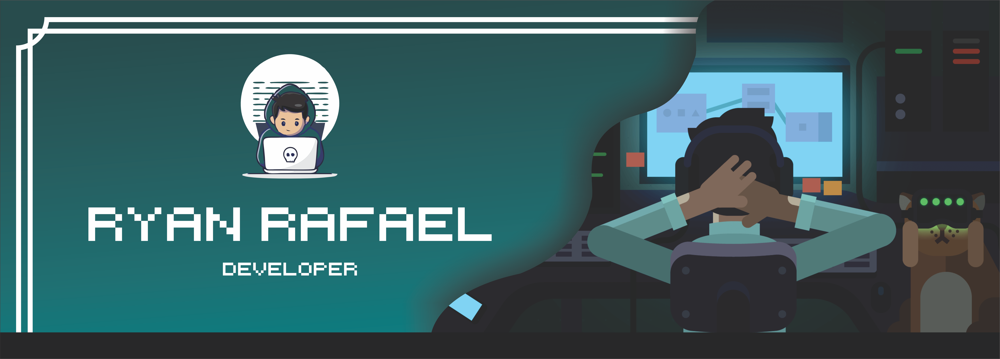

  

  
   
  

  

<!-- 
  
  
   

-->

<!-- 
  
<a href="https://ryanrafaa.github.io/#topo" target="_blank">

  -->

  
<a href="https://www.linkedin.com/in/ryan-rafael-rocha-097a5a14a//" target="_blank">
<a href="https://www.instagram.com/ryanrafaag/" target="_blank">
<a href="https://steamcommunity.com/id/rafaagoncalves/" target="_blank">

 
  

 
<b>Visitors Count</b>
  

 
 

 
### Main skills:
&nbsp;
&nbsp;
&nbsp;
&nbsp;
&nbsp;
&nbsp;

  
### Other Knowledge:
&nbsp; 
&nbsp;
&nbsp;
&nbsp;
&nbsp;
&nbsp;
&nbsp;
&nbsp;
&nbsp;
&nbsp;
&nbsp;

  
### Studying in this moment:
&nbsp;

