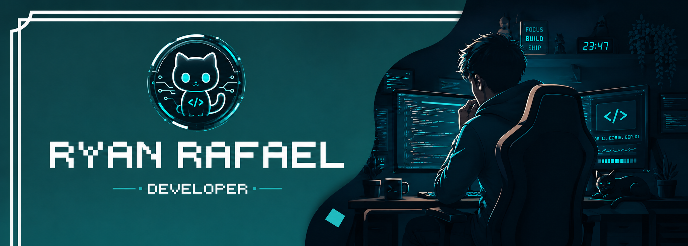
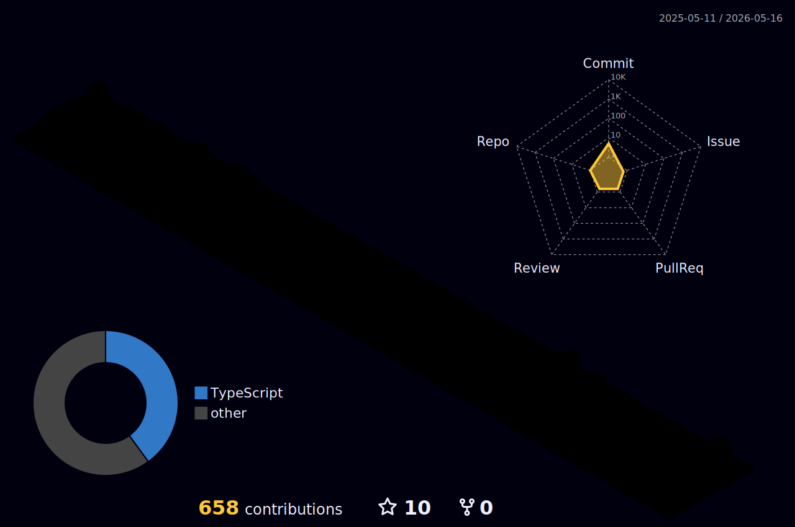

<!-- Typing SVG Animation -->
<p align="center">
  <a href="https://git.io/typing-svg">
    
  </a>
</p>

<!-- Social Links -->
<p align="center">
  <a href="https://www.linkedin.com/in/ryan-rafael-rocha-097a5a14a/">
    
  </a>
</p>

<!-- Profile Views Counter -->
<p align="center">
  
</p>

<br/>

<!-- About Me Section -->

## 👨‍💻 About Me

```typescript
const ryan = {
  name: "Ryan Rafael",
  location: "Brazil 🇧🇷",
  age: 24,
  role: "Project Manager & Full-Stack Developer",
  education: {
    degree: "Systems Analysis and Development",
    postGrad: "AI & Software Architecture (In Progress)"
  },
  currentFocus: [
    "Leading development teams",
    "Building scalable web applications",
    "Creating tools for streamers",
    "Studying AI & Software Architecture"
  ],
  languages: ["Portuguese", "Spanish", "English"],
  motto: "Transforming ideas into impactful solutions 🚀"
};
```

<br/>

<!-- Stats Section with Details -->
<details open>
<summary>📊 <b>GitHub Statistics</b></summary>

<br/>

<div align="center">
<a href="https://bit.ly/gh-readme-profile"></a> 
  
</div>

<br/>

<!-- Streak Stats -->
<div align="center">
  
</div>

<br/>

<!-- Trophy -->
<div align="center">
  
</div>

</details>

<br/>

<!-- Skills Section with Dropdowns -->
<details open>
<summary>🛠️ <b>Technical Skills & Tools</b></summary>

<br/>

<details open>
<summary>💻 <b>Programming Languages</b></summary>
<br/>


</details>

<details open>
<summary>🧰 <b>Frameworks & Libraries</b></summary>
<br/>


</details>

<details open>
<summary>🗄️ <b>Databases & Tools</b></summary>
<br/>


</details>

<details>
<summary>📚 <b>Currently Learning</b></summary>
<br/>


</details>

</details>

<br/>

<!-- 3D Contribution Graph -->
<details open>
<summary>📈 <b>Contribution Graph</b></summary>

<br/>

<picture>
  <source media="(prefers-color-scheme: dark)" srcset="./profile-3d-contrib/profile-night-rainbow.svg">
  <source media="(prefers-color-scheme: light)" srcset="./profile-3d-contrib/profile-season-animate.svg">
  
</picture>

</details>

<br/>

<!-- Activity Graph -->
<details>
<summary>⚡ <b>Recent Activity</b></summary>

<br/>


</details>

<br/>

<!-- Featured Projects -->
<details>
<summary>🚀 <b>Featured Projects</b></summary>

<br/>

<div align="center">
  <a href="https://github.com/RyanRafaa?tab=repositories">
    
  </a>
</div>

</details>

<br/>

<!-- Fun Facts -->
<details>
<summary>🎮 <b>Fun Facts & Interests</b></summary>

<br/>

```javascript
const interests = {
  hobbies: ["Gaming 🎮", "Coding 💻", "Learning new technologies 📚"],
  favoriteGames: ["Counter Strike 🎯"],
  workStyle: "Clean code enthusiast ✨",
  funFact: "I love turning coffee into code! ☕→💻",
};
```

</details>

<br/>

<!-- Contact Section -->
<details>
<summary>📫 <b>Let's Connect!</b></summary>

<br/>

<div align="center">

### Feel free to reach out! I'm always open to interesting conversations and collaboration opportunities.

<br/>

| Platform     | Link                                                                          |
| ------------ | ----------------------------------------------------------------------------- |
| 💼 LinkedIn  | [Ryan Rafael Rocha](https://www.linkedin.com/in/ryanrafaa/) |
| 📸 Instagram | [@ryanrafaag](https://www.instagram.com/ryanrafaag/)                          |
| 🎮 Steam     | [rafaagoncalves](https://steamcommunity.com/id/rafaagoncalves/)               |

<br/>

[](mailto:ryanrafael5@gmail.com)

</div>

</details>

<br/>

---

<div align="center">
  
### 💭 Quote of the Day
  


<br/>

### ✨ Thanks for visiting! ✨

<picture>
  <source media="(prefers-color-scheme: dark)" srcset="./snake-animation/github-user-contribution.svg">
  <source media="(prefers-color-scheme: light)" srcset="./snake-animation/github-user-contribution.svg">
  
</picture>

</div>

<br/>


